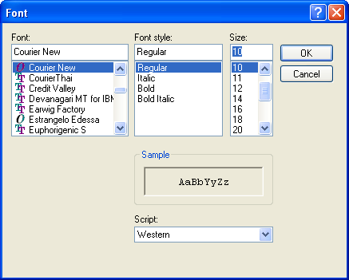
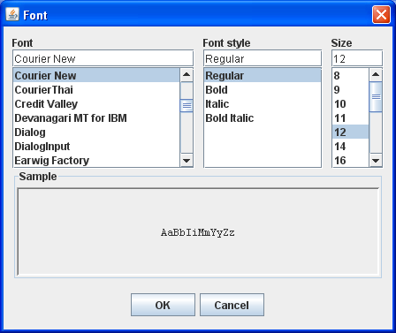

java.fontchooser
================

Java Swing Font Chooser
-----------------------

I modeled my font chooser after the font chooser in Windows XP 
Notepad. I couldn’t do exactly what the Notepad developers did, 
since I was working within the limitations of Java. During some 
debugging, I noticed that the Java Font class had a bunch of 
private and private package fields that would have been helpful 
to my font chooser.

Here’s an image of the Notepad font chooser.

Here's an image of my Jaca font chooser.

I originally wanted to make this Java font chooser a part of an 
editor that I’m working on. When I realized how large a project 
the font chooser was, I moved it into it’s own Java project. 
